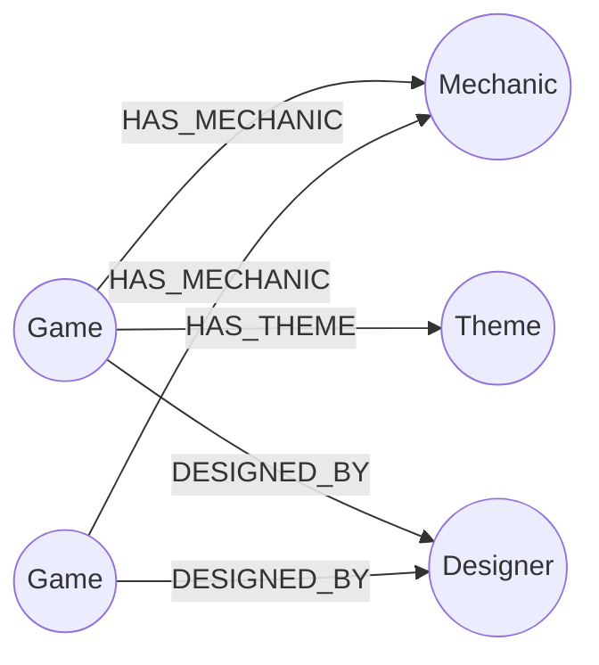

# TableLink — Board Game Recommendation Graph

A small web app that helps you discover new board games through the ones
you already like, built on **CognoDB** (a managed graph database speaking
openCypher over Bolt) using the official Neo4j Python driver.

Live demo: **[add your hosted URL here]**
Screen recording: **[add your recording link here]**

---

## The use case

TableLink models a personal board game collection as a graph: games,
the mechanics they use, the themes they explore, and the designers who
made them. From that graph it answers two kinds of questions a board
game enthusiast actually asks:

1. *"I like this game — what else might I like?"* (shared-mechanic recommendations)
2. *"How on earth are these two completely different games related?"* (path finding)

## Why a graph database?

The interesting part of this data isn't the games themselves — it's the
**relationships between them**. A relational schema forces every
interesting question here into a join-heavy query or a recursive CTE:

- Finding games that share 2+ mechanics means joining the `games` and
  `game_mechanics` tables against themselves and grouping — doable, but
  it gets uglier fast as you add more relationship types (themes,
  designers) to the same recommendation.
- Finding the shortest path between two arbitrary games through *any*
  combination of shared mechanic, theme, or designer, at *unknown depth*,
  is the kind of query relational databases are structurally bad at.
  SQL needs a recursive common table expression with manually bounded
  depth; Cypher expresses it as a single `shortestPath()` pattern match,
  regardless of how many hops it turns out to take.

In short: the questions TableLink answers are about *connectivity*, not
aggregation over rows, which is exactly the case a graph database is
built for.

## Data model



**Nodes**
| Label      | Properties                                                            |
|------------|------------------------------------------------------------------------|
| `Game`     | `name`, `year_published`, `min_players`, `max_players`, `play_time_minutes` |
| `Mechanic` | `name`                                                                  |
| `Theme`    | `name`                                                                  |
| `Designer` | `name`                                                                  |

**Relationships**
| Type            | Direction              |
|-----------------|-------------------------|
| `HAS_MECHANIC`  | `Game -> Mechanic`      |
| `HAS_THEME`     | `Game -> Theme`         |
| `DESIGNED_BY`   | `Game -> Designer`      |

Seed data: 16 games, 4 designers, 8 mechanics, 8 themes, deliberately
overlapping so the recommendation and path-finding queries have
something meaningful to traverse.

## Setup & run instructions

### 1. Create a CognoDB instance

1. Sign up at [console.cognodb.com/signup](https://console.cognodb.com/signup) (no card required).
2. Create a free **c0** instance and pick a region.
3. Copy the connection URI (`bolt+s://<instance-id>.databases.cognodb.com`)
   and the generated password for user `cognodb` — the password is shown
   only once.

### 2. Clone and configure

```bash
git clone <your-repo-url>
cd board-game-graph
cp .env.example .env
```

Edit `.env` with your real CognoDB URI, username, and password:

```
COGNODB_URI=bolt+s://your-instance-id.databases.cognodb.com
COGNODB_USER=cognodb
COGNODB_PASSWORD=your_password_here
```

### 3. Install dependencies

```bash
pip install -r requirements.txt
```

### 4. Verify the connection

```bash
python test_connection.py
```

You should see `Connected to CognoDB successfully.`

### 5. Seed the database

```bash
python seed_data.py
```

This creates 16 games and their mechanics, themes, and designers. It's
safe to re-run — it uses `MERGE`, so it won't create duplicates.

### 6. Run the app

```bash
python app.py
```

Open `http://127.0.0.1:5000` in your browser.

## The main queries

All queries live in `queries.py` and are called from `app.py` — no raw
Cypher is ever built by string concatenation; every value is passed as
a driver parameter.

### 1. Shared-mechanic recommendations (multi-hop, 2 hops)

```cypher
MATCH (g:Game {name: $game_name})-[:HAS_MECHANIC]->(m:Mechanic)
      <-[:HAS_MECHANIC]-(other:Game)
WHERE other.name <> $game_name
WITH other, collect(m.name) AS shared_mechanics, count(m) AS shared_count
WHERE shared_count >= $min_shared
RETURN other.name AS recommended_game, shared_mechanics, shared_count
ORDER BY shared_count DESC
```

Walks from a game, out to its mechanics, and back in to any other game
sharing them — a 2-hop traversal — then groups by how many mechanics
are shared. This powers the "Recommended if you like…" section and the
connection-web diagram on each game's page.

### 2. Shortest path between two games (the SQL-awkward one)

```cypher
MATCH path = shortestPath(
    (a:Game {name: $game_a})-[*..4]-(b:Game {name: $game_b})
)
RETURN [node IN nodes(path) | coalesce(node.name, labels(node)[0])] AS path_nodes,
       length(path) AS hops
```

Finds the shortest chain connecting two games through *any* relationship
type and *any* number of hops (bounded at 4 here). This powers the "Find
a connection" page. Note: the hop bound (`4`) is inserted as a literal
rather than a query parameter because Cypher doesn't support
parameterizing variable-length path bounds (`[*..N]`) — it's still safe
here since the value always comes from application code, never user
input.

### 3. Designer theme range (simple aggregation)

```cypher
MATCH (d:Designer {name: $designer_name})<-[:DESIGNED_BY]-(g:Game)
      -[:HAS_THEME]->(t:Theme)
RETURN d.name AS designer,
       collect(DISTINCT t.name) AS themes_covered,
       count(DISTINCT g) AS games_designed
```

Powers each designer's profile page.

## Project structure

```
board-game-graph/
├── app.py                 # Flask routes
├── queries.py              # All Cypher queries, parameterized
├── seed_data.py             # Loads seed data via MERGE
├── test_connection.py       # Standalone connectivity check
├── requirements.txt
├── .env.example
├── .gitignore                # .env is never committed
├── static/
│   └── style.css
└── templates/
    ├── base.html
    ├── index.html            # Browse / filter
    ├── game.html             # Game detail + connection web
    ├── connect.html          # Path finder
    ├── designer.html
    ├── db_error.html         # Shown when CognoDB is unreachable
    └── not_found.html
```

## Screenshots

*(add screenshots of the homepage, a game detail page, and the
connection page here before submitting)*
